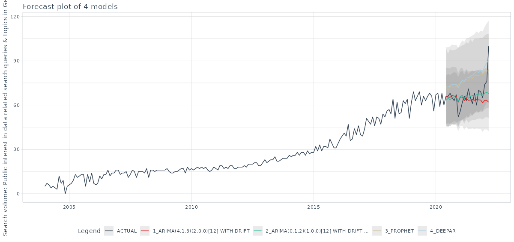

# Time Series

## The relationship between data and economy related search queries and topics in Germany

### Background and motivation: 
There is significant public interest in  the ongoing data revolution and how this transformation is related to the economy. I checked the relationship between interest in economy and data utilizing search volume from Google Trends.

### Data and methods:
Data comes from Google Trends. Collected data reflects the public interest in Germany for two things.
1) Data -- interest in data science, big data, data engineering, business intelligence etc.
2) Economy -- how the economy is doing in terms of growth, crisis, investment etc.

I used multiple search queries and Google topics (see [this](https://blog.google/products/search/15-tips-getting-most-out-google-trends/) for more on Google topics) as a proxy to public interest.

I summarized these multiple search queries and topics by taking their first principal component (somewhat mimicking Eichenauer et al.'s approach. You can also visit [this link](https://www.trendecon.org/#method) or read the paper at [https://doi.org/10.1111/ecin.13049](https://doi.org/10.1111/ecin.13049)).

### Findings:
The search volume of economy related search queries & topics is only weakly related to the search volume of data related search queries and topics. The association is negligible.

The public interest for data in Germany can be forecasted independent of the economy. The best model to forecast this public interest is boosted ARIMA.

#### References:

Eichenauer, V.Z., Indergand, R., Martínez, I.Z. & Sax, C. (2022) Obtaining consistent time series from Google Trends. Economic Inquiry, 60( 2), 694– 705.
https://doi.org/10.1111/ecin.13049